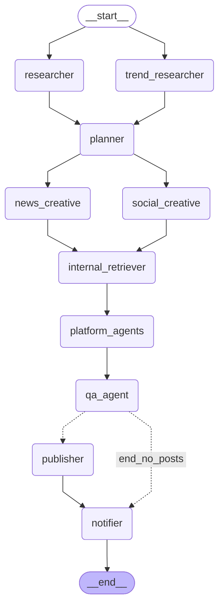
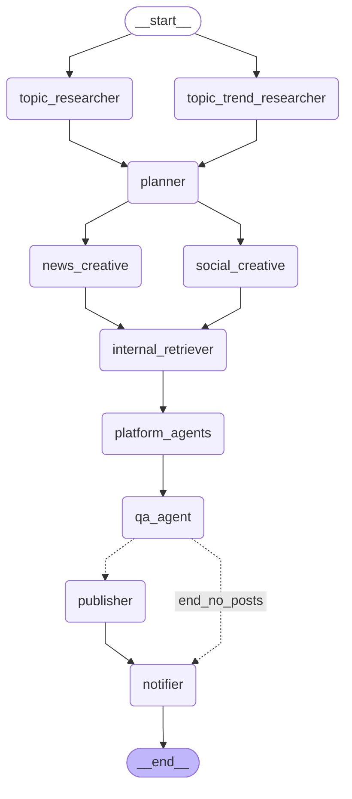

# Housing.com AI Content Agent — Architecture Reference

> **Last updated:** May 2026  
> Covers the full multi-agent pipeline: research → planning → creative → QA → publish, plus the UI dashboard, database, and scheduler.

---

## Table of Contents

1. [System Overview](#1-system-overview)
2. [High-Level Agent Interaction Diagram](#2-high-level-agent-interaction-diagram)
3. [Detailed Pipeline Flow](#3-detailed-pipeline-flow)
4. [Agent Reference](#4-agent-reference)
5. [Tool & API Reference](#5-tool--api-reference)
6. [Prompt Design & Guardrails](#6-prompt-design--guardrails)
7. [QA System (3-Pass)](#7-qa-system-3-pass)
8. [LangGraph Topology](#8-langgraph-topology)
9. [State Machine](#9-state-machine)
10. [Database Schema](#10-database-schema)
11. [API Endpoints](#11-api-endpoints)
12. [UI Dashboard](#12-ui-dashboard)
13. [Cost Model](#13-cost-model)
14. [Configuration Reference](#14-configuration-reference)
15. [Execution Modes](#15-execution-modes)

---

## 1. System Overview

The Housing.com AI Content Agent is a multi-agent LangGraph pipeline that continuously publishes real estate content to Twitter, Instagram, LinkedIn, YouTube, and housing.com/news. It monitors India's trending topics, finds a housing angle inside viral moments (Zomato-style), writes platform-native content, runs 3-pass QA, and either saves locally (dry-run) or posts live.

```
Input sources → Research (parallel) → Planner → Creative (parallel) → Platform agents → QA → Publish
```

**Stack:**
- **LLM providers:** Anthropic Claude (Haiku, Sonnet, Opus) + Google Gemini 2.5 Flash (optional, 53% cheaper for fast tasks)
- **Graph framework:** LangGraph (state machine + checkpointing)
- **Backend:** FastAPI + SQLAlchemy + SQLite (or Postgres)
- **Scheduler:** APScheduler (9 AM + 6 PM IST daily)
- **Frontend:** React + Vite + TanStack Query
- **Trend sources:** Google Trends, YouTube Trending, Reddit India, Serper News, Tavily
- **Notifications:** Slack (Socket Mode bot + webhook summaries)

---

## 2. High-Level Agent Interaction Diagram

```
┌─────────────────────────────────────────────────────────────────────────┐
│                     HOUSING.COM AI CONTENT AGENT                        │
│                                                                         │
│   SCHEDULED RUN (graph.py)          SLACK-TRIGGERED (direct_graph.py)  │
│                                                                         │
│   ┌──────────────┐                  ┌───────────────────┐              │
│   │  researcher  │ ←─ Tavily         │  topic_researcher │ ←─ Tavily    │
│   └──────┬───────┘    web search    └─────────┬─────────┘   web search │
│          │ (parallel)                          │ (parallel)             │
│   ┌──────────────────┐              ┌──────────────────────┐            │
│   │ trend_researcher │ ←─ Google    │topic_trend_researcher│ ←─ Serper  │
│   └──────┬───────────┘   Trends,   └──────────┬───────────┘            │
│          │               YouTube,             │                        │
│          │               Reddit, Serper       │                        │
│          └──────────┬────────────────────────┘                        │
│                     ▼                                                   │
│              ┌─────────────┐                                            │
│              │   planner   │  ← Haiku/Gemini Flash (quality gate)      │
│              └──────┬──────┘    filters topics with no RE angle        │
│                     │                                                   │
│          ┌──────────┴──────────┐                                        │
│          ▼                     ▼                                        │
│  ┌────────────────┐  ┌─────────────────┐                               │
│  │ social_creative│  │  news_creative  │                               │
│  │  (Opus 4.7)    │  │  (Sonnet 4.6)   │                               │
│  │  Zomato-style  │  │  SEO articles   │                               │
│  └────────┬───────┘  └────────┬────────┘                               │
│           └────────┬──────────┘                                         │
│                    ▼                                                    │
│          ┌──────────────────┐                                           │
│          │internal_retriever│  ← Haiku/Gemini Flash                    │
│          │  (link builder)  │    extracts RE signals, city links        │
│          └────────┬─────────┘                                           │
│                   ▼                                                     │
│  ┌────────────────────────────────────────────────────────────┐        │
│  │                  platform_agents (parallel)                 │        │
│  │                                                            │        │
│  │  ┌─────────┐ ┌──────────┐ ┌─────────┐ ┌──────────────┐  │        │
│  │  │ twitter │ │instagram │ │ youtube │ │ housing_news │  │        │
│  │  │ Sonnet  │ │ Sonnet   │ │ Sonnet  │ │   Sonnet     │  │        │
│  │  └─────────┘ └──────────┘ └─────────┘ └──────────────┘  │        │
│  │                    ┌──────────┐                           │        │
│  │                    │ linkedin │                           │        │
│  │                    │ Sonnet   │                           │        │
│  │                    └──────────┘                           │        │
│  └───────────────────────────┬────────────────────────────────┘        │
│                              ▼                                          │
│                    ┌──────────────────┐                                 │
│                    │    qa_agent      │  3-pass evaluation              │
│                    │  Pass 1: Safety  │  ← Gemini Flash / Haiku         │
│                    │  Pass 2: Quality │  ← Sonnet 4.6                   │
│                    │  Pass 3: Engmnt  │  ← Gemini Flash / Haiku        │
│                    └────────┬─────────┘       Sonnet (news)            │
│                             │                                           │
│                    ┌────────┴──────────┐                                │
│                    ▼                   ▼                                │
│              [approved]           [rejected]                            │
│                    │                   │                                │
│                    ▼                   ▼                                │
│             ┌──────────┐        ┌──────────┐                           │
│             │publisher │        │ notifier │ ← "no posts" Slack alert  │
│             └────┬─────┘        └──────────┘                           │
│                  │                                                      │
│          ┌───────┴────────┐                                             │
│          ▼                ▼                                             │
│     [dry_run=T]      [dry_run=F]                                        │
│   output/<run_id>/  post live via                                       │
│      *.md files      platform APIs                                      │
│          │                │                                             │
│          └───────┬────────┘                                             │
│                  ▼                                                      │
│            ┌──────────┐                                                 │
│            │ notifier │ ← Slack thread summary                          │
│            └──────────┘                                                 │
└─────────────────────────────────────────────────────────────────────────┘
```

---

## 3. Detailed Pipeline Flow

### Step-by-step execution (scheduled run)

```
START
 │
 ├─(parallel)─────────────────────────────────────────────────────────────┐
 │                                                                         │
 ▼                                                                         ▼
[researcher]                                                  [trend_researcher]
 • Tavily web search (credible RE domains)                     • Google Trends (pytrends)
 • Up to 5 search rounds, stops at 6 stories                   • YouTube Trending India
 • Claude Sonnet 4.6 curates 8 NewsItems                       • Reddit India (r/india etc.)
 • Fields: headline, source, url, summary, relevance           • Apify/Twitter (optional)
                                                               • Serper News (optional)
                                                               • Claude Sonnet curates 15 TrendItems
                                                               • Deduplicates against last 48h DB
                                                               • Adds creative_hook in Hinglish
 │                                                                         │
 └─────────────────────────┬───────────────────────────────────────────────┘
                           │
                           ▼
                       [planner]
                        • Claude Haiku / Gemini Flash
                        • Reads research[] + trends[]
                        • Quality gate: OMITS topics with no genuine RE angle
                        • Emits ≤8 ContentBriefs (max 5 social + 3 news)
                        • Sets: draft_type, platforms, tone, urgency, seo_keywords
                        • Tone options: hinglish_viral | formal_seo | educational
                           │
             ┌─────────────┴─────────────┐
             │                           │
             ▼                           ▼
    [social_creative]           [news_creative]
     • Claude Opus 4.7           • Claude Sonnet 4.6
     • ≤2 social drafts          • ≤1 news draft
     • Zomato style              • 700–1000 word SEO article
     • Hinglish + trend hook     • Curiosity-gap headline
     • city SRP links embedded   • H2 keyword structure
     • Media format selection    • ≥2 internal links
     • Returns: CreativeDraft[]  • Returns: CreativeDraft[]
             │                           │
             └─────────────┬─────────────┘
                           │ (operator.add merges both lists)
                           │
                           ▼
                  [internal_retriever]
                   • Claude Haiku / Gemini Flash
                   • Reads creative_drafts[]
                   • Extracts RE signals per draft:
                     cities[], localities[], filters{},
                     re_intent, theme
                   • Builds internal_links[] (housing.com SRPs,
                     builder pages, locality guides)
                   • Writes back to draft.internal_links
                           │
                           ▼
              [platform_agents] ← asyncio.gather (180s timeout)
                           │
         ┌─────────────────┼───────────────────────────┐
         │        │        │        │                   │
         ▼        ▼        ▼        ▼                   ▼
     [twitter] [instagram] [youtube] [housing_news] [linkedin]
      Sonnet    Sonnet      Sonnet    Sonnet          Sonnet
         │        │        │        │                   │
         └─────────────────┼───────────────────────────┘
                           │ (operator.add merges all PlatformPosts)
                           │
                           ▼
                       [qa_agent]
                           │
            ┌──────────────┼──────────────┐
            │              │              │
            ▼              ▼              ▼
        PASS 1          PASS 2          PASS 3
        Safety          Quality         Engagement
        Gate            Scoring         Prediction
       (binary)        (per-platform    (impressions,
        Hard fail:      dimensions)     likes, ER)
        reject on
        violation
            │
            ▼
        Decision: publish | revise | reject
            │
        ┌───┤ revise → platform agent re-runs (max 2 retries)
        │   │          QA re-evaluates
        │   │
        │   ▼ publish
        │   approved_posts[]
        │
        │   ▼ reject (all retries exhausted OR safety fail)
        │   (dropped from run)
        │
        ▼
  [conditional edge]
    approved_posts empty? → [notifier] "no approved posts"
    approved_posts exist? → [publisher]
                                 │
                       ┌─────────┴────────┐
                       ▼                  ▼
                  dry_run=True       dry_run=False
                  Save to            Post live via
                  output/<id>/       platform APIs
                  *.md files         (Twitter, IG,
                  Save to DB         YouTube, etc.)
                  Schedule           Save to DB
                  engagement         Slack Slack draft
                  tracking           notification (HITL)
                       │
                       ▼
                  [notifier]
                  Slack thread per platform
                  Shows: content preview, QA score,
                  pred ER, link to post
```

---

## 4. Agent Reference

### researcher
| Property | Value |
|---|---|
| **File** | `agents/researcher.py` |
| **Model** | Sonnet 4.6 (`model_balanced`) |
| **Runs** | Parallel with trend_researcher |
| **Input state** | `topic_hint` (optional) |
| **Output state** | `research: list[NewsItem]` |
| **External APIs** | Tavily (`web_search`) + SerpAPI (`SERP_API_KEY`, optional) |
| **Preferred domains** | economictimes, hindustantimes, housing.com, anarock, jll, credai, 99acres, magicbricks, PIB, MHUPA, RERA state portals |
| **Search strategy** | Up to 5 rounds; stops early when ≥6 quality stories found |
| **Output size** | 8 NewsItems: headline, source, url, summary, relevance |
| **Retry policy** | max_attempts=3, exponential backoff |

---

### trend_researcher
| Property | Value |
|---|---|
| **File** | `agents/social_trend_researcher.py` |
| **Model** | Sonnet 4.6 (`model_balanced`) |
| **Runs** | Parallel with researcher |
| **Input state** | None (pulls from live sources) |
| **Output state** | `trends: list[TrendItem]` |
| **External APIs** | Google Trends (pytrends), YouTube Data API v3, Reddit (PRAW), Serper News (optional), SerpAPI (optional), Twitter bearer token → Apify → RapidAPI (3-way fallback chain) |
| **Output size** | 15 TrendItems with Hinglish creative_hook |
| **Deduplication** | Checks DB: skips hashtags published in last 48h |
| **Key rule** | Trend hook = hero; RE = punchline (Zomato style) |

---

### planner
| Property | Value |
|---|---|
| **File** | `agents/planner.py` |
| **Model** | Gemini 2.5 Flash / Haiku (`model_fast`) |
| **Input state** | `research[]`, `trends[]` |
| **Output state** | `content_briefs: list[ContentBrief]` |
| **Purpose** | Quality gate — filters out topics with no genuine RE angle |
| **Max output** | 5 social + 3 news = 8 ContentBriefs per run |
| **Toggle** | `enable_planner=False` skips this node |
| **Log line** | `planner: N briefs from M inputs (social=X, news=Y)` |

**Decision rules:**
| Topic type | draft_type | Platforms |
|---|---|---|
| Viral/entertainment + wordplay | social | twitter, instagram |
| IT/layoffs/career trend | social | twitter, linkedin |
| RE policy/RERA/builder news | news | housing_news |
| Rich explainer topic | news | housing_news, youtube |
| No plausible RE angle | — | OMIT entirely |

---

### social_creative
| Property | Value |
|---|---|
| **File** | `agents/social_creative_agent.py` |
| **Model** | Opus 4.7 (`model_creative`) — best creative writing |
| **Input state** | `content_briefs[]` (filtered to social) OR `trends[]` (fallback) |
| **Output state** | `creative_drafts: list[CreativeDraft]` (merged via operator.add) |
| **Style** | Zomato-style: witty, Hinglish, trend-first |
| **Max output** | ≤2 social drafts per run |
| **Examples** | Loaded from `prompts/hooks_bank.json` via `get_relevant_examples()` |

**Critical rules:**
- Trend hook is the **HERO**; housing is the **punchline** (not bolted on)
- First hashtag MUST be the original trending hashtag (e.g., `#FA9LA`)
- City SRP URL embedded when any city is mentioned (housing.com/in/buy/\<city\>)
- Media format decision: `branded_card` (PIL generated), `meme_overlay` (stub for social team), `text_only`
- Avoid: religious angles, communal content, named politician tagging

---

### news_creative
| Property | Value |
|---|---|
| **File** | `agents/news_creative_agent.py` |
| **Model** | Sonnet 4.6 (`model_balanced`) |
| **Input state** | `content_briefs[]` (filtered to news) OR `research[]` (fallback) |
| **Output state** | `creative_drafts: list[CreativeDraft]` (merged via operator.add) |
| **Style** | SEO-first, 700–1000 word articles |
| **Max output** | ≤1 news draft per run |

**Article structure:** H1 (curiosity-gap) → opener (surprising, conversational) → H2 sections (keyword-rich) → data callout → expert take → pull quote → CTA with internal links

**Headline rule:**  
NOT "Pune Property Prices 2025 Update"  
BUT "The City Nobody Expected to Beat Mumbai — Pune's Quiet Property Surge in 2025"

---

### internal_retriever
| Property | Value |
|---|---|
| **File** | `agents/internal_link_agent.py` |
| **Model** | Gemini 2.5 Flash / Haiku (`model_fast`) |
| **Input state** | `creative_drafts[]` |
| **Output state** | Updates `draft.internal_links[]` and `draft.re_signals` |
| **Purpose** | Extracts RE signals; builds housing.com internal links |

**Signal extraction:**
- **cities[]** — 20+ Housing.com markets (delhi, mumbai, bengaluru, hyderabad, etc.)
- **localities[]** — area-level (Bandra, Whitefield, Gurgaon Sec 56, etc.)
- **filters{}** — bedroom_count, budget_min/max, property_type
- **re_intent** — buy | rent | invest | none
- **theme** — price_trend | infra | policy | lifestyle | viral

---

### platform_agents (orchestrated)
| Property | Value |
|---|---|
| **File** | `agents/platform_orchestrator.py` |
| **Runs** | All 5 agents in `asyncio.gather()` |
| **Timeout** | 180 seconds (`platform_agent_timeout`) |
| **Input** | `creative_drafts[]` (each draft routed to compatible platforms) |
| **Output** | `platform_posts: list[PlatformPost]` (merged via operator.add) |

#### twitter_agent
| Property | Value |
|---|---|
| **File** | `agents/platform/twitter_agent.py` |
| **Model** | Sonnet 4.6 |
| **Hard constraint** | Main tweet ≤ 280 chars |
| **Hashtags** | ≤4 total; trend hashtag FIRST |
| **Style** | Hinglish + max 2 emojis |
| **Handle tagging** | MANDATORY for brands/teams/celebrities; `[LOOKUP: Name]` if unsure → resolved by `handle_resolver.py` |
| **Image** | Optional branded card if model suggests it |
| **Thread** | Allowed for deeper storytelling (up to 3 tweets) |

#### instagram_agent
| Property | Value |
|---|---|
| **File** | `agents/platform/instagram_agent.py` |
| **Model** | Sonnet 4.6 |
| **Hard constraint** | Caption ≤ 150 chars |
| **Hashtags** | 15–20 total; trend tag first → #HousingDotCom → topic tags |
| **Media** | PIL-generated 1080×1080 branded card (purple bg, white Rubik font, Housing logo) |
| **Design rule** | Caption + card must feel like one designed unit |

#### youtube_agent
| Property | Value |
|---|---|
| **File** | `agents/platform/youtube_agent.py` |
| **Model** | Sonnet 4.6 |
| **Outputs** | Shorts script (hook/body/cta, ~30s, ~2 words/sec) OR Long-form outline (chapters, thumbnail concept) |
| **SEO** | Title ≤70 chars; description ≤150 chars above fold |
| **Categories** | News & Politics, Education, Finance, Entertainment |

#### housing_news_agent
| Property | Value |
|---|---|
| **File** | `agents/platform/housing_news_agent.py` |
| **Model** | Sonnet 4.6 |
| **Output** | Full article in `extra.article_body` (markdown), seo_title, meta_description, slug, pull_quote |
| **Article length** | 700–1000 words |
| **Internal links** | ≥2 contextually embedded (NOT a list at the end) |
| **Pull quote** | Must work as a standalone tweet |

#### linkedin_agent
| Property | Value |
|---|---|
| **File** | `agents/platform/linkedin_agent.py` |
| **Model** | Sonnet 4.6 |
| **Hard constraint** | Post body 150–400 chars |
| **Triggered when** | Draft includes "linkedin" in `target_platforms[]` (set by planner for careers/layoffs/tech trends) |
| **Goal** | Employer brand (not property listings); CTA to housing.com/careers |
| **Tone** | Dry wit, English-forward, data-backed, GenZ-resonant; NOT "thrilled/humbled/excited" |

---

### qa_agent
| Property | Value |
|---|---|
| **File** | `agents/qa_agent.py` |
| **Pass 1 model** | `model_fast` (Gemini Flash / Haiku) — safety gate, temperature=0 |
| **Pass 2 model** | `model_balanced` (Sonnet 4.6) — per-platform quality scoring |
| **Pass 3 model** | `model_fast` (Gemini Flash / Haiku) — engagement heuristic prediction |
| **Concurrency** | Pass 1 runs first (fast-fail on safety); Passes 2+3 run **in parallel** via `asyncio.gather` |
| **Input state** | `platform_posts[]` |
| **Output state** | `qa_results[]`, `approved_posts[]` |

See [Section 7](#7-qa-system-3-pass) for full detail.

---

### publisher
| Property | Value |
|---|---|
| **File** | `agents/publisher.py` |
| **Input state** | `approved_posts[]` |
| **Output state** | `published: list[PublishedPost]` |
| **Dry-run** | Saves markdown files to `output/<run_id>/` |
| **Live** | Posts via platform APIs (Twitter, Instagram, YouTube, LinkedIn) |
| **DB** | Saves all posts with QA scores + predicted metrics |
| **Slack (HITL)** | Sends draft review message with Approve/Reject buttons if `enable_hitl=True` |
| **Engagement** | Schedules 6h / 24h / 7d metric fetch jobs |

---

### notifier
| Property | Value |
|---|---|
| **File** | `tools/slack_notifier.py` |
| **Triggered** | After publisher (success path) OR when no approved posts |
| **Output** | Slack thread with per-platform preview, QA score, pred engagement rate, post link |

---

### topic_researcher (direct graph only)
| Property | Value |
|---|---|
| **File** | `agents/topic_researcher.py` |
| **Model** | Sonnet 4.6 |
| **Input** | `slack_topic` / `topic_hint` (user-supplied) |
| **Output** | `research: list[NewsItem]` (1–4 items) |
| **Used in** | Slack-triggered runs (`direct_graph.py`) |

---

### topic_trend_researcher (direct graph only)
| Property | Value |
|---|---|
| **File** | `agents/topic_trend_researcher.py` |
| **Model** | Sonnet 4.6 |
| **Input** | Same topic string |
| **Output** | `trends: list[TrendItem]` (2–5 items) |
| **Sources** | Serper news (preferred) → Tavily (fallback) |
| **Used in** | Slack-triggered runs (`direct_graph.py`) |

---

## 5. Tool & API Reference

### LLM Router (`tools/llm_router.py`)

Central dispatcher — picks provider + model by tier, handles retries.

| Tier | Default model | Fallback | Use cases |
|---|---|---|---|
| `fast` | Gemini 2.5 Flash (if key set) | Claude Haiku 4.5 | Planner, safety gate, link extraction |
| `balanced` | Claude Sonnet 4.6 | — | Research, quality QA, all platform agents |
| `creative` | Claude Opus 4.7 | — | Social creative writing, engagement prediction |

**Functions:**
- `call_json_sync(tier, system, user_msg, ...)` — sync JSON response
- `call_json_async(tier, system, user_msg, temperature=1.0, ...)` — async JSON response
- `acall_message(client, model, system, messages, temperature=1.0, ...)` — raw Message object (streaming compatible)
- Exponential backoff: `initial_interval=1.0s`, `backoff_factor=2.0`, `max_attempts=2` (LLM-level, in addition to LangGraph node-level `max_attempts=3`)

**Cost tracking (May 2026, per million tokens):**
| Model | Input | Output |
|---|---|---|
| Gemini 2.5 Flash | $0.30 | $2.50 |
| Claude Haiku 4.5 | $1.00 | $5.00 |
| Claude Sonnet 4.6 | $3.00 | $15.00 |
| Claude Opus 4.7 | $5.00 | $25.00 |

---

### Web Search (`tools/web_search.py`)

| Function | Provider | Use |
|---|---|---|
| `web_search(query, ...)` | Tavily | RE news research (deep results) |
| `serper_news_search(query, api_key, ...)` | Serper | Trending news (faster, India-localised) |
| `web_search_async(query, tavily_client)` | Tavily (async wrapper) | Parallel fetches in trend_researcher |

**Tavily search depth:** `basic` (1 credit, default) or `advanced` (5 credits) — configurable.

---

### Social Trends (`tools/social_trends.py`)

| Source | Function | What it returns |
|---|---|---|
| Google Trends | `get_google_trending_searches()` | Top 20 trending terms in India |
| Google Trends | `get_google_interest(keywords)` | Interest score 0–100 for RE keywords |
| YouTube Data API v3 | `get_youtube_trending_india()` | Top videos by category (sports/entertainment/music/news/comedy) |
| Reddit India | `get_reddit_viral(subreddits)` | Viral posts from r/india, r/BollyBlinds, r/IndiaInvestments, etc. |
| Apify/Twitter | (stub) | Future: real-time Twitter signals |

All sources fail gracefully — `fetch_all_trends()` returns whatever is available.

---

### Branded Image Generator (`tools/branded_image_generator.py`)

- **Tech:** PIL (Pillow) — no API cost, fully local
- **Output:** 1080×1080 PNG — purple background, white Rubik font, Housing.com logo (bottom-right)
- **Functions:** `generate_branded_card(text, output_path)`, `generate_branded_card_async(text, output_path)`
- **Used by:** Instagram agent (media_format = "branded_card"), Twitter agent (optional)

---

### Example Retriever (`tools/example_retriever.py`)

- **Source:** `prompts/hooks_bank.json`
- **Matching:** Tags-based scoring (e.g., "cricket", "ipl", "bengaluru", "celebration")
- **Output:** Top 8 positive examples + 2 negative examples (what NOT to write)
- **Format injected into creative prompts:** card text + hashtags + `AVOID THIS: WHY BAD: ...`

**Negative example format:**
```json
{
  "id": "neg-001",
  "event": "Generic banner ad copy",
  "tags": ["general"],
  "card": "Real estate in India is growing.",
  "avoid_because": "Generic, no trend angle, reads like a banner ad"
}
```

---

### Housing URLs (`tools/housing_urls.py`)

| Function | Output |
|---|---|
| `city_srp_url(city_slug)` | `https://housing.com/in/buy/<city>` |
| `resolve_city(city_name)` | Fuzzy match to 20+ Housing.com market slugs |
| `builder_link(builder_slug, city_slug)` | Builder microsite URL |
| `project_link(project_slug, ...)` | Project microsite URL |

---

### Handle Resolver (`tools/handle_resolver.py`)

| Function | Purpose |
|---|---|
| `resolve_handles_in_text(text, platform)` | Replaces `[LOOKUP: EntityName]` with actual @handles |
| `inject_known_mentions(text, mentions, platform)` | Auto-tags brands/teams mentioned but not yet tagged |

Known handles: Zomato, Swiggy, HDFC, RCB, SRK, Virat Kohli, etc. (extensible dict).

---

### Creative Utils (`tools/creative_utils.py`)

| Function | Purpose |
|---|---|
| `get_performance_history()` | Queries DB for top/bottom performers; injected into creative prompts |
| `parse_drafts(raw_json_text, default_type)` | Robust JSON extraction from LLM response |
| `normalize_drafts(drafts)` | Fills default fields on CreativeDraft objects |

---

### Housing Retriever (`tools/housing_retriever.py`)

| Function | Purpose |
|---|---|
| `fetch_links_for_signals(signals)` | Takes extracted RE signals dict → returns list of internal housing.com links |

Complements `housing_urls.py` — this layer takes structured signals (cities, localities, filters, intent) and orchestrates URL construction across city, builder, and project types.

---

### Link Embedder (`tools/link_embedder.py`)

| Function | Purpose |
|---|---|
| `embed_city_links(content, platform, links)` | Embeds internal links into Markdown or LinkedIn post body (platform-aware formatting) |

---

### Image Generator (`tools/image_generator.py`)

DALL-E 3 image generation for Twitter and YouTube thumbnails (when `enable_image_generation=True` and `OPENAI_API_KEY` is set).

| Function | Purpose |
|---|---|
| `generate_image(media_format, platform, prompt, output_path)` | Calls DALL-E 3 with Housing-style suffix to generate platform images |

DALL-E failures return `None` — post is published text-only without aborting.

---

### SerpAPI Utils (`tools/serpapi_utils.py`)

| Function | Purpose |
|---|---|
| `get_serpapi_re_news(api_key)` | Fetch India RE news headlines via SerpAPI Google News |
| `get_serpapi_google_trends_india(api_key)` | Fetch Google Trends India via SerpAPI (async) |

Optional supplement to pytrends when `SERP_API_KEY` is set.

---

### Asset Storage (`tools/asset_storage.py`)

| Function | Purpose |
|---|---|
| `upload_asset(local_path, run_id, filename)` | Uploads media to configured backend (local / S3 / GCS / R2) |

Backend selected by `ASSET_STORAGE_BACKEND` env var. Returns a public URL or local path.

---

### Run Context (`tools/run_context.py`)

Thread-safe `run_id` propagation via Python `ContextVar`.

| Function | Purpose |
|---|---|
| `set_run_id(run_id)` | Set current run ID in async context |
| `get_run_id()` | Retrieve run ID from any coroutine without passing it explicitly |
| `reset_run_id(token)` | Reset context variable after run completes |

---

### JSON Utils (`tools/json_utils.py`)

| Function | Purpose |
|---|---|
| `extract_json(text)` | Safe JSON extraction from LLM output — strips fences, prose, fixes common malformations via `json-repair` |

---

### RE Signals Utils (`tools/re_signals_utils.py`)

| Function | Purpose |
|---|---|
| `safe_signals(draft)` | Normalizes and validates RE signals dict from a CreativeDraft |

---

### Slack Bot (`tools/slack_bot.py`)

| Function | Purpose |
|---|---|
| `run_socket_mode_bot()` | Starts Slack Socket Mode listener — DMs or @mentions trigger `direct_graph` runs |

Invoked by `python main.py slack-bot`.

---

### Run Logger (`tools/run_logger.py`)

Structured per-run logging to `output/<run_id>/run.log` and DB (`llm_calls`, `api_calls` tables):
- `log_llm_call()` — agent, model, tokens, cost_usd, elapsed_ms (also writes `LlmCallRecord` to DB)
- `log_api_call()` — tool, api_name, endpoint, params, result_count, status (also writes `ApiCallRecord`)
- `log_tool_call()` — generic tool logging
- `log_agent_io()` — agent name, input/output summaries
- `Timer` — context manager for elapsed_ms tracking

---

## 6. Prompt Design & Guardrails

### Core Creative Philosophy

The pipeline follows the **"Zomato model"** of brand content:
1. Find what's already going viral in India
2. Find the housing angle INSIDE the trend (not bolted on)
3. The trend hook is the HERO; the RE connection is the PUNCHLINE
4. Write like a witty friend, not a brand account

**Example transformations:**
| Trend | Housing angle |
|---|---|
| RCB wins IPL after 18 years | "18 saal se ghar lene ki soch rahe ho bhai?" |
| Budget 2025: ₹12L tax-free | "Bahana kya hai? Ghar le lo!" + Mumbai SRP link |
| Summer 48°C | "AC on, Housing.com kholo — ghar search karo" |
| AI layoffs | "AI ne job li, ghar lo apna — WFH forever" → LinkedIn |
| Champions Trophy win | "Yeh moment hai bhai — apna ghar lene ka" |

### Hooks Bank (`prompts/hooks_bank.json`)

Curated examples indexed by event + tags. Each entry has:
```json
{
  "id": "rcb-2025-ipl-win",
  "event": "RCB IPL Win",
  "tags": ["cricket", "ipl", "rcb", "celebration", "bengaluru"],
  "card": "Ee Sala Cup Namdu! 🏆",
  "caption": "18 saal baad cup aaya... ab ghar ka time hai!",
  "city_hint": "bengaluru",
  "media_format": "branded_card",
  "meme_concept": "Virat Kohli crying + trophy",
  "hashtags": ["#EeSalaCupNamdu", "#IPL2025", "#HousingDotCom"]
}
```

Plus `"negative_examples"` array showing what to AVOID (generic banner ad copy, forced RE angle, corporate jargon).

### Guardrails (enforced across all agents)

**Hard blocks (safety gate will REJECT):**
- Religious / caste / communal content
- Political party names or election campaigning
  - ✅ Government policies (PMAY, RERA) are fine
  - ❌ "BJP's housing scheme" or "Congress opposes..." is blocked
- Defamation of named builders / companies / individuals
- Forward-looking price guarantees: "WILL rise 40%", "guaranteed 15% returns"
  - ✅ "Property in Bengaluru has historically appreciated" is fine
- Housing discrimination (religion/caste/gender in property listings context)
- Explicit / violent / sexually suggestive content
- Insider information about listed companies

**Handle tagging rules:**
- MANDATORY for brands, sports teams, celebrities publicly active on platform
- FORBIDDEN for named politicians, ministers, billionaires (as individuals)
- Use `[LOOKUP: Name]` if unsure → handle_resolver.py resolves or drops

**Women in property:**
- Celebrating women as homebuyers, women's names on property, female homebuyer content = ✅ OK (promotion, not discrimination)

---

## 7. QA System (3-Pass)

### Architecture

```
PlatformPost
     │
     ▼
PASS 1: Safety Gate
  Model: Gemini Flash / Haiku (fast, cheap — fail fast)
  Output: {passed: bool, violations: [], categories: []}
  Hard fail → REJECT immediately
     │ passed=True
     ▼
PASS 2: Quality Scoring
  Model: Sonnet 4.6 (balanced)
  Per-platform dimensions, 0–10 scale
  Output: {re_relevance_score, backlink_score, brand_voice_score,
           overall_quality_score, quality_issues[], quality_scores{}}
  Below threshold → REVISE (up to 2 retries)
     │ above threshold
     ▼
PASS 3: Engagement Prediction   ← runs in parallel with Pass 2 via asyncio.gather
  Model: model_fast (Gemini Flash / Haiku)
  Output: {pred_impressions, pred_likes, pred_shares, pred_comments,
           pred_ctr, pred_engagement_rate, pred_confidence,
           engagement_reasoning, top_element, weak_element}
     │
     ▼
Decision: publish | revise | reject
```

### Per-Platform Quality Dimensions

**Twitter**
| Dimension | Weight | Description |
|---|---|---|
| trend_dominance | 35% | Trend hook is the hero, not a suffix |
| shareability | 30% | Would someone retweet without feeling cringey? |
| hinglish_wit | 25% | Natural Hinglish, max 2 emojis |
| character_compliance | 10% | ≤280 chars (CRITICAL hard constraint) |

**Instagram**
| Dimension | Weight | Description |
|---|---|---|
| card_hook_strength | 30% | Card visual earns attention in feed |
| trend_and_shareability | 30% | Shareable + trend-native |
| caption_punch | 25% | ≤150 chars, Hinglish, witty |
| hashtag_strategy | 15% | 15–20 tags; trend tag first |

**LinkedIn**
| Dimension | Weight | Description |
|---|---|---|
| employer_brand_angle | 30% | Careers/culture angle, not property push |
| trend_jacking_professional | 25% | Professional riff on the trend |
| tone_and_wit | 25% | Dry wit, not corporate buzzwords |
| data_credibility | 10% | Claims cited, @handles used |
| length_compliance | 10% | 150–400 chars |

**Housing News**
| Dimension | Weight | Description |
|---|---|---|
| factual_accuracy | 30% | No made-up prices, no unsourced claims |
| headline_quality | 20% | Curiosity-gap, not keyword dump |
| seo_quality | 20% | Primary keyword in H1 + H2s, ≤5 secondary |
| article_structure | 15% | Opening → data → expert → quote → CTA |
| internal_links | 15% | ≥2 contextually embedded |

**YouTube**
| Dimension | Weight | Description |
|---|---|---|
| hook_three_seconds | 30% | First 3 seconds earn the view |
| trend_or_education_strength | 25% | Viral hook OR genuine education |
| script_naturalness | 25% | Flows at ~2 words/second |
| data_accuracy | 10% | Wrong data = fail; absence = OK |
| cta_and_seo | 10% | Follow + housing.com link; SEO title |

### Quality Thresholds

| Platform | Min quality score | Min predicted ER |
|---|---|---|
| twitter | 6.5 / 10 | 0.5% |
| instagram | 6.0 / 10 | 2.0% |
| linkedin | 6.5 / 10 | 0.0% |
| housing_news | 7.0 / 10 | 0.0% |
| youtube | 6.0 / 10 | 0.0% |

### Decision Logic (`_decide()`)

```python
# For each post after Pass 2 + 3:
if any hard_dim score < 5.0:
    → "revise" (if overall ≥ 4.0) or "reject"

if overall_quality_score < platform_min_quality:
    → "revise" (if overall ≥ 4.0) or "reject"

if platform has min_er > 0 and pred_er < min_er:
    → "revise" (if overall ≥ 4.0) or "reject"

if no issues:
    → "publish"
```

**Hard threshold:** `overall_quality_score < 4.0` = hard reject. No revision attempted — post is too far gone.

### Revision Loop

```
QA → "revise" decision
  │
  ▼
Pass 2 critique injected into platform-specific revision system prompt
  │
  LOCKED (never change):
    Twitter:       Cultural/trend hook, Hinglish voice, human emotion
    Instagram:     Cultural hook, card concept theme
    LinkedIn:      Professional trend hook
    Housing News:  All factual claims — never change a stat
    YouTube:       Trend or education angle
  │
  FIXABLE:
    Twitter:       Trim to ≤280 chars, sharpen punchline, fix CTA
    Instagram:     Trim caption to ≤150 chars, hashtag order, card strength
    LinkedIn:      Employer brand CTA, length (150-400), dry wit, data attribution
    Housing News:  Headline, SEO, article structure, internal links
    YouTube:       Opening hook, script naturalness, CTA
  │
  HARD RULE: If trend hook was already swapped for RE data → reject, do not revise
  │
  ▼
Revision agent produces revised content → full QA cycle repeats (Pass 1 + 2 + 3)
  │
  ├── Still fails after max_qa_retries (default 2) → REJECT
  └── Passes → approved_posts[]
```

### Engagement Prediction Benchmarks

| Platform | Average | Good | Viral |
|---|---|---|---|
| twitter | 0.8% ER | 2–4% | 8%+ |
| instagram | 3% ER | 6–8% | 12%+ |
| youtube | 4% CTR | 8–12% | 15%+ |
| housing_news | 1,000 sessions | 3,000+ | 5,000+/month |
| linkedin | 0.5% ER | 2–3% | 5%+ |

Scoring drivers: 40% hook strength, 25% relevance, 20% emotional resonance, 15% CTA quality.

---

## 8. LangGraph Topology

> Diagrams generated via `get_graph().draw_mermaid()` — source of truth is the compiled graph.

### Main Graph (`workflow/graph.py`)

Triggered by the APScheduler cron (9 AM / 6 PM IST) and `POST /run`. Parallel research fan-in at planner; parallel creative fan-in at internal_retriever; conditional QA edge to publisher or notifier.



**Retry policy (all nodes except publisher/notifier):** `RetryPolicy(max_attempts=3, initial_interval=1.0, backoff_factor=2.0)`

### Direct Graph (`workflow/direct_graph.py`)

Triggered by Slack bot (`POST /api/runs/direct`). Research phase replaced by topic-specific agents; rest of pipeline is identical to the main graph.



---

## 9. State Machine

**`WorkflowState`** (TypedDict in `models/state.py`) flows through every node:

```
Phase           Fields
─────────────────────────────────────────────────────────────────────
Bootstrap       run_id, triggered_at, dry_run, topic_hint,
                target_platforms, slack_topic

Research        research: list[NewsItem]
                trends: list[TrendItem]

Planning        content_briefs: list[ContentBrief]

Creative        creative_drafts: Annotated[list[CreativeDraft], operator.add]
                (both social_creative and news_creative write here; reducer merges)

Platform        platform_posts: Annotated[list[PlatformPost], operator.add]
                (each platform agent writes; reducer merges all)

QA              qa_results: list[QAResult]
                approved_posts: list[PlatformPost]
                retry_count: int
                qa_post_attempts: dict[str, int]

Output          published: list[PublishedPost]
                error: Optional[str]
```

**Key TypedDicts:**

```python
class ContentBrief(TypedDict):
    topic: str
    angle: str
    draft_type: str           # "social" | "news"
    target_platforms: list[str]
    tone: str                 # "hinglish_viral" | "formal_seo" | "educational"
    city_hint: Optional[str]
    urgency: str
    seo_keywords: list[str]
    source_summary: str

class CreativeDraft(TypedDict):
    id: str
    draft_type: str           # "social" | "news"
    angle: str
    headline: str
    hook: str
    body: str
    zomato_hook: str          # the one-liner punchline
    caption: str
    city_hint: Optional[str]
    media_format: str         # "branded_card" | "meme_overlay" | "text_only"
    trend_hashtag: str
    hashtags: list[str]
    seo_keywords: list[str]
    target_platforms: list[str]
    internal_links: list[dict]
    re_signals: Optional[RESignals]
    meme_concept: Optional[str]
    urgency_hook: Optional[str]

class RESignals(TypedDict, total=False):
    cities: list[str]
    localities: list[str]
    filters: RESignalsFilters  # bedroom_count, budget_min/max, property_type
    re_intent: str             # "buy" | "rent" | "invest" | "none"
    theme: str                 # "price_trend" | "infra" | "policy" | "lifestyle" | "viral"
```

---

## 10. Database Schema

**File:** `db/models.py` | **Engine:** SQLite (default) or Postgres

### `published_posts` table

| Column | Type | Description |
|---|---|---|
| `post_id` | VARCHAR(36) PK | UUID |
| `run_id` | VARCHAR(36) | Links to run |
| `platform` | VARCHAR(50) | twitter / instagram / youtube / housing_news / linkedin |
| `platform_post_id` | VARCHAR(100) | Platform's own ID after live posting |
| `published_url` | TEXT | Live URL |
| `output_path` | TEXT | Local file path (dry-run) |
| `content` | TEXT | Post content |
| `hashtags` | TEXT | JSON array |
| `internal_links` | TEXT | JSON array |
| `media_urls` | TEXT | JSON array |
| `extra_data` | TEXT | JSON — platform-specific (article_body, shorts_script, etc.) |
| `creative_angle` | TEXT | |
| `draft_type` | VARCHAR(20) | social / news |
| `zomato_hook` | TEXT | One-liner hook |
| `trend_hashtag` | VARCHAR(100) | |
| `media_format` | VARCHAR(50) | branded_card / meme_overlay / text_only |
| `source_topic` | TEXT | |
| `trend_data` | TEXT | JSON copy of TrendItem |
| `published_at` | DATETIME | |
| `qa_safety_passed` | BOOLEAN | |
| `qa_re_relevance` | FLOAT | 0–10 |
| `qa_backlink_score` | FLOAT | 0–10 |
| `qa_brand_voice` | FLOAT | 0–10 |
| `qa_overall` | FLOAT | 0–10 |
| `qa_decision` | VARCHAR(20) | publish / advisory |
| `post_status` | VARCHAR(20) | published / draft / qa_rejected |
| `qa_rejection_reasons` | TEXT | JSON array |
| `qa_critique` | TEXT | Full QA critique text |
| `qa_quality_dimensions` | TEXT | JSON dict of per-dimension scores |
| `engagement_reasoning` | TEXT | QA engagement analysis |
| `pred_impressions` | FLOAT | |
| `pred_likes` | FLOAT | |
| `pred_shares` | FLOAT | |
| `pred_comments` | FLOAT | |
| `pred_ctr` | FLOAT | |
| `pred_engagement_rate` | FLOAT | |
| `pred_confidence` | FLOAT | 0–1 |
| `actual_impressions_6h` | FLOAT | Filled by engagement tracker |
| `actual_likes_6h` | FLOAT | |
| `actual_impressions_24h` | FLOAT | |
| `actual_likes_24h` | FLOAT | |
| `actual_shares_24h` | FLOAT | |
| `actual_comments_24h` | FLOAT | |
| `actual_ctr_24h` | FLOAT | |
| `actual_saves_24h` | FLOAT | |
| `actual_impressions_7d` | FLOAT | |
| `actual_engagement_7d` | FLOAT | |
| `actual_housing_traffic` | FLOAT | Sessions from housing.com analytics |
| `prediction_accuracy` | FLOAT | actual_er / pred_er |
| `user_rating` | INTEGER | 1–5 star rating (from dashboard) |
| `user_tags` | TEXT | JSON array of manual tags |
| `user_feedback` | TEXT | Free text |
| `user_action` | VARCHAR(20) | approved / rejected / flagged (manual) |
| `rejection_reason` | TEXT | Manual rejection reason |

**Connection:** `db/connection.py` — SQLAlchemy, additive ALTER TABLE migrations (safe for SQLite), `get_db_session()` context manager.

---

### `runs` table

| Column | Type | Description |
|---|---|---|
| `run_id` | VARCHAR(36) unique | UUID |
| `status` | VARCHAR(32) | `running` / `completed` / `failed` |
| `triggered_at` | DATETIME | |
| `completed_at` | DATETIME | |
| `dry_run` | BOOLEAN | |
| `topic_hint` | TEXT | |
| `target_platforms` | TEXT | JSON array |
| `research_count` | INTEGER | Stories found |
| `trends_count` | INTEGER | Trends found |
| `briefs_count` | INTEGER | Content briefs emitted |
| `drafts_count` | INTEGER | Creative drafts produced |
| `posts_attempted` | INTEGER | Posts sent to QA |
| `posts_approved` | INTEGER | Posts that passed QA |
| `posts_published` | INTEGER | Posts actually posted/saved |
| `error` | TEXT | Error message if failed |
| `summary_json` | TEXT | Full `summary.json` content |

---

### `users` table

| Column | Type | Description |
|---|---|---|
| `id` | INTEGER PK | |
| `username` | VARCHAR(64) unique | Login username |
| `password_hash` | VARCHAR(128) | bcrypt hash |
| `role` | VARCHAR(32) | `admin` / `investor` |
| `created_at` | DATETIME | |
| `is_active` | BOOLEAN | |

Pre-seeded via `_migrate()` on first startup (backfill when table is empty).

---

### `llm_calls` table

Full record of every LLM call made during runs — used for cost analytics and debugging.

| Column | Type | Description |
|---|---|---|
| `run_id` | VARCHAR(36) | |
| `called_at` | DATETIME | |
| `agent` | VARCHAR(128) | e.g. `qa/safety/twitter/abc123` |
| `model` | VARCHAR(64) | |
| `system_prompt` | TEXT | Full system prompt |
| `user_message` | TEXT | Full user message |
| `response_text` | TEXT | Full LLM response |
| `stop_reason` | VARCHAR(32) | |
| `input_tokens` | INTEGER | |
| `output_tokens` | INTEGER | |
| `cost_usd` | FLOAT | Calculated at call time |
| `elapsed_ms` | INTEGER | |

---

### `api_calls` table

Full record of every external API call (Tavily, SerpAPI, Apify, YouTube, Reddit).

| Column | Type | Description |
|---|---|---|
| `run_id` | VARCHAR(36) | |
| `called_at` | DATETIME | |
| `agent` | VARCHAR(64) | |
| `api_name` | VARCHAR(64) | e.g. `tavily_search`, `serpapi_news`, `youtube_trending` |
| `endpoint` | VARCHAR(512) | URL or method name |
| `params_json` | TEXT | Full request params |
| `response_json` | TEXT | Full response |
| `result_count` | INTEGER | Items returned |
| `status` | VARCHAR(16) | `ok` / `error` |
| `http_status` | INTEGER | |
| `error` | TEXT | |
| `elapsed_ms` | INTEGER | |
| `use_case` | TEXT | Human description e.g. `Tavily: Karnataka RERA 2026` |

---

## 11. API Endpoints

**Base URL:** `http://localhost:8000`

### Core / Health

| Method | Path | Description |
|---|---|---|
| `GET` | `/health` | Health check (used by Railway healthcheck) |
| `GET` | `/api/config` | Runtime config snapshot (models, platforms, feature flags) |
| `GET` | `/{path}` | SPA fallback — serves the React UI for all unmatched paths |

### Pipeline (Runs)

| Method | Path | Description |
|---|---|---|
| `POST` | `/run` | Trigger async scheduled-style run (returns `run_id`) |
| `POST` | `/api/run` | Alias for `/run` |
| `POST` | `/api/runs/direct` | Trigger direct run with `slack_topic` body field |
| `GET` | `/api/runs/{run_id}/status` | Lightweight status poll: `running` / `completed` / `failed` |
| `GET` | `/api/runs/{run_id}` | Full run detail: state, LLM call logs, events |
| `GET` | `/api/runs/{run_id}/calls` | LLM + API call log for a specific run |
| `GET` | `/api/runs` | List recent runs (newest first, limit 50) |

### Posts

| Method | Path | Description |
|---|---|---|
| `GET` | `/api/posts/stats` | Aggregate stats (total, avg QA scores, by platform) |
| `GET` | `/api/posts/top` | Top N posts by predicted engagement |
| `GET` | `/api/posts` | List posts (filter by platform, status, action, date) |
| `GET` | `/api/posts/{post_id}` | Single post with full QA scores + engagement |
| `POST` | `/api/posts/{post_id}/feedback` | Submit user rating / tags / free-text action |
| `POST` | `/api/posts/{post_id}/publish` | Manually publish a draft post |
| `POST` | `/api/posts/{post_id}/reject` | Archive / reject a post |
| `POST` | `/api/posts/{post_id}/media` | Upload custom media for a post |

### Analytics

| Method | Path | Description |
|---|---|---|
| `GET` | `/api/analytics` | Dashboard data: posts over time, cost per run, predicted vs actual engagement |

### Prompts

| Method | Path | Description |
|---|---|---|
| `GET` | `/api/prompts` | List hooks_bank.json examples |
| `POST` | `/api/prompts` | Add new example to hooks bank |
| `PUT` | `/api/prompts/{id}` | Update an existing example |
| `DELETE` | `/api/prompts/{id}` | Remove example |

### Trends

| Method | Path | Description |
|---|---|---|
| `GET` | `/api/trends/live` | Fetch live Google Trends + YouTube + Reddit (5-min cache) |
| `POST` | `/api/trends/search` | Tavily search for a topic |

### Settings

| Method | Path | Description |
|---|---|---|
| `GET` | `/api/settings` | List all .env settings (masked) with section + type |
| `POST` | `/api/settings` | Update a setting (writes to .env) |

### Auth

| Method | Path | Description |
|---|---|---|
| `POST` | `/api/auth/login` | OAuth2 password login — returns JWT bearer token |
| `GET` | `/api/auth/me` | Get current authenticated user (requires bearer token) |

### Investor

| Method | Path | Description |
|---|---|---|
| `POST` | `/api/investor/interest` | Log investor interest form submission |

### Slack

| Method | Path | Description |
|---|---|---|
| `POST` | `/slack/action` | Interactive button handler (Approve/Reject for HITL, kill-switch) |
| `POST` | `/slack/events` | Slack Event API webhook (slash commands, mentions) |

---

## 12. UI Dashboard

**Stack:** React + Vite + TanStack Query + Tailwind CSS  
**Start:** `python main.py ui` (serves both API on :8000 and UI on :5173)

### Pages

| Page | Route | Key features |
|---|---|---|
| **Dashboard** | `/` | Stats cards (Total Posts, QA Rate, Active Runs, Draft count), clickable → filtered views; platform breakdown chart; recent runs |
| **Posts** | `/posts` | Filterable table (platform, status, action, search); draft badge; XSS-safe markdown links; publish from list |
| **Post Detail** | `/posts/:id` | Full post content; QA scores bars; engagement metrics (predicted vs actual); star rating; user feedback; Publish button for drafts; QA Advisory badge |
| **Generate** | `/generate` | Trigger new run with topic + platform selection; real-time progress stream; published post cards with links to post detail |
| **Trending** | `/trending` | Live signals (Google Trends, YouTube, Reddit); Tavily search; clickable rows open detail modal; copy buttons per field |
| **Runs** | `/runs/:id` | Full run timeline: research items, trends, briefs, drafts, posts, events log |
| **Prompts** | `/prompts` | CRUD for hooks_bank.json examples |
| **Settings** | `/settings` | .env editor grouped by section; boolean toggle switches; masked API key display |

### Key UI Patterns

- **XSS protection:** `renderContent()` in Posts + PostDetail guards against `javascript:` / `data:` URIs — falls back to `#` for non-HTTPS hrefs
- **Trending modals:** Each row opens a detail modal (title, URL, content, volume, creative_hook — all with copy buttons); Escape key + backdrop click to close
- **HITL publish:** "↑ Publish" button on PostDetail for `post_status=draft` posts; calls `POST /api/posts/{id}/publish`
- **Boolean settings:** Toggle switches for pipeline boolean flags (enable_planner, dry_run, etc.)
- **Draft status:** Amber badge throughout Posts + PostDetail; filterable in Posts list

---

## 13. Cost Model

### Per-run cost estimate (typical)

| Agent | Model | Calls | Approx cost |
|---|---|---|---|
| researcher | Sonnet 4.6 | 1 multi-turn | ~$0.05 |
| trend_researcher | Sonnet 4.6 | 1 call | ~$0.03 |
| planner | Gemini Flash | 1 call | ~$0.003 |
| social_creative | Opus 4.7 | 1 call (long) | ~$0.20 |
| news_creative | Sonnet 4.6 | 1 call (long) | ~$0.08 |
| internal_retriever | Gemini Flash | 1–3 calls | ~$0.005 |
| platform_agents (×5) | Sonnet 4.6 | 5 calls | ~$0.15 |
| qa_agent (safety) | Gemini Flash | 5 calls | ~$0.01 |
| qa_agent (quality) | Sonnet 4.6 | 5 calls | ~$0.10 |
| qa_agent (engagement) | Gemini Flash / Haiku | 5 calls | ~$0.005 |
| **Total (no revision)** | | | **~$0.77** |
| **Total (1 revision loop)** | | | **~$1.10** |

Gemini Flash fast-tier (planner, safety, retriever) saves ~$0.08 vs all-Haiku. Two runs/day = ~$1.50–2.20/day.

Every LLM call logs token counts + cost to `output/<run_id>/run.log` and `summary.json`.

---

## 14. Configuration Reference

**File:** `config.py` — reads from `.env`

### Required

| Key | Description |
|---|---|
| `ANTHROPIC_API_KEY` | Claude access (all tiers) |
| `TAVILY_API_KEY` | Web search for research + topic runs |

### Optional — LLM

| Key | Default | Description |
|---|---|---|
| `GEMINI_API_KEY` | — | Enables Gemini 2.5 Flash for fast tier (53% cheaper) |

### Optional — Social Publishing

| Key | Description |
|---|---|
| `TWITTER_API_KEY`, `TWITTER_API_SECRET`, `TWITTER_ACCESS_TOKEN`, `TWITTER_ACCESS_SECRET` | Twitter v2 posting |
| `INSTAGRAM_ACCESS_TOKEN`, `INSTAGRAM_BUSINESS_ACCOUNT_ID` | Instagram Graph API |
| `YOUTUBE_CLIENT_ID`, `YOUTUBE_CLIENT_SECRET`, `YOUTUBE_REFRESH_TOKEN` | YouTube Data API |
| `LINKEDIN_ACCESS_TOKEN` | LinkedIn API |

### Optional — Trend Sources

| Key | Description |
|---|---|
| `SERPER_API_KEY` | Serper.dev (fast Google News; falls back to Tavily if absent) |
| `SERP_API_KEY` | SerpAPI (Google News + Google Trends India; optional supplement) |
| `RAPIDAPI_KEY` | RapidAPI Twitter Trends (3rd fallback after bearer token + Apify) |
| `YOUTUBE_API_KEY` | YouTube Data API v3 for Trending India |
| `APIFY_API_TOKEN` | Apify Twitter/X trend scraping (2nd fallback after bearer token) |
| `REDDIT_CLIENT_ID` | Reddit PRAW app client ID |
| `REDDIT_CLIENT_SECRET` | Reddit PRAW app client secret |
| `REDDIT_USER_AGENT` | Reddit user-agent string (default: `housing-marketeer/1.0`) |

### Optional — Notifications

| Key | Description |
|---|---|
| `SLACK_BOT_TOKEN` | Bot token (for posting + receiving commands) |
| `SLACK_APP_TOKEN` | App-level token (Socket Mode — required for `python main.py slack-bot`) |
| `SLACK_SIGNING_SECRET` | Request verification for `/slack/action` + `/slack/events` |
| `SLACK_CHANNEL_ID` | Channel for run summaries |

### Product Identity

| Key | Default | Description |
|---|---|---|
| `APP_NAME` | `"NAVA"` | Brand/product name — used by the UI (`VITE_APP_NAME`) and backend; override to white-label |

### Pipeline Behaviour

| Key | Default | Description |
|---|---|---|
| `DRY_RUN` | `True` | Save locally; never post live |
| `HUMAN_IN_THE_LOOP` | `False` | When `True`: posts saved as drafts, require manual publish via UI |
| `TARGET_PLATFORMS` | `"twitter,instagram,youtube,housing_news,linkedin"` | Comma-separated |
| `MAX_CREATIVE_DRAFTS` | `3` | Max drafts per run |
| `PLATFORM_AGENT_TIMEOUT` | `180` | Seconds before platform agent asyncio.gather times out |
| `LLM_TIMEOUT` | `60.0` | Seconds per individual LLM call |
| `LLM_RETRIES` | `2` | LLM-level retry attempts (backoff: 1s → 2s) |
| `MAX_QA_RETRIES` | `2` | QA revision loop max attempts per post |
| `ENABLE_PLANNER` | `True` | Toggle planner quality-gate node |
| `ENABLE_IMAGE_GENERATION` | `True` | Generate PIL branded cards (and DALL-E if `OPENAI_API_KEY` set) |
| `ENABLE_FILE_OUTPUTS` | `True` | Write `output/<run_id>/` files; set `False` when using cloud asset storage |
| `TAVILY_SEARCH_DEPTH` | `"basic"` | `"basic"` (1 credit) or `"advanced"` (5 credits) |

### Infrastructure

| Key | Default | Description |
|---|---|---|
| `DATABASE_URL` | `sqlite+aiosqlite:///./housing_content.db` | App database (use `postgresql://...` for Postgres) |
| `CHECKPOINT_DB_PATH` | `"checkpoints.db"` | LangGraph AsyncSqliteSaver checkpoint DB |
| `ENABLE_CHECKPOINTING` | `True` | LangGraph run resumability via SQLite checkpointer |
| `ASSETS_DIR` | `"assets"` | Local path for fonts + logo used in PIL branded card generation |

### Asset Storage (Cloud Media)

| Key | Default | Description |
|---|---|---|
| `ASSET_STORAGE_BACKEND` | `"local"` | `"local"` / `"s3"` / `"gcs"` — where generated images are stored |
| `AWS_S3_BUCKET` | — | S3 bucket name (required when `ASSET_STORAGE_BACKEND=s3`) |
| `AWS_S3_REGION` | `"us-east-1"` | S3 region |
| `AWS_S3_PREFIX` | `"housing-marketeer"` | S3 key prefix |
| `GCS_BUCKET` | — | GCS bucket name (required when `ASSET_STORAGE_BACKEND=gcs`) |
| `GCS_PREFIX` | `"housing-marketeer"` | GCS object prefix |

### Model routing (internal)

| Property | Value | Used for |
|---|---|---|
| `model_fast` | Gemini 2.5 Flash (if `GEMINI_API_KEY` set) else `claude-haiku-4-5-20251001` | Planner, QA safety gate, QA engagement prediction, internal link extraction |
| `model_balanced` | `claude-sonnet-4-6` | Research agents, QA quality scoring, all platform agents, news creative |
| `model_creative` | `claude-opus-4-7` | Social creative agent (Zomato-style hooks) |

---

## 15. Execution Modes

### `python main.py run`
Single end-to-end run using `workflow/graph.py`. Outputs to `output/<run_id>/`.

```bash
python main.py run                                    # dry-run (default)
python main.py run --live                             # live posting (overrides DRY_RUN)
python main.py run --dry-run                          # explicit dry-run
python main.py run --topic "Mumbai stamp duty"        # topic-focused run
python main.py run --platforms twitter,instagram      # override TARGET_PLATFORMS
```

### `python main.py serve`
FastAPI server + APScheduler (9 AM + 6 PM IST daily cron via `scheduler/jobs.py`). Both the API and the scheduler run in the same process.

### `python main.py slack-bot`
Socket Mode Slack bot (`tools/slack_bot.py`). DMs or @mentions trigger `direct_graph.py` runs. Requires `SLACK_BOT_TOKEN` + `SLACK_APP_TOKEN`.

### `python main.py ui`
Starts the API server on `:8000`. The UI is served as a pre-built SPA from `ui/dist/` — run `cd ui && npm run build` first if not already built.

### `python main.py history`
Prints engagement history from DB — predicted vs actual performance over time.

### Run output structure

```
output/
  <run_id>/
    run.log              # structured per-agent logs with token costs
    summary.json         # run metadata, QA scores, token totals, cost
    twitter_<id>.md      # tweet content + hashtags
    instagram_<id>.md    # caption + card description
    instagram_<id>.png   # PIL-generated branded card
    youtube_<id>.md      # Shorts script + long-form outline
    housing_news_<id>.md # Full SEO article (markdown)
    linkedin_<id>.md     # LinkedIn post
```

---

## Appendix: Key Design Decisions

See `docs/design_debates.md` for:
1. **Human-in-the-loop (HITL)** — Why `interrupt()` was deferred; current proxy is 3-pass QA
2. **Single vs multi-pass QA** — Why 3 separate passes beat one combined judge (positional bias, model tier mismatch)
3. **FireCrawl for paywalled content** — Deferred; Tavily covers open sources adequately today

**Other architectural choices:**
- `operator.add` on `creative_drafts` and `platform_posts` allows safe parallel fan-in without overwriting
- All platform agents share `_api_retry` but publisher/notifier have no retry (idempotency concern)
- Gemini Flash as fast tier is purely a cost optimisation — falls back to Haiku silently if no key
- `checkpoints.db` is separate from `housing_content.db` — LangGraph state vs application data
- Per-run `run.log` alongside global DB means full auditability even if DB is wiped

---

## Related Documents

| Document | Covers |
|---|---|
| `docs/CONTENT_STRATEGY.md` | Zomato model, per-platform content pillars, LinkedIn employer brand strategy, QA decision logic with full thresholds, engagement feedback loop, anti-patterns catalogue |
| `docs/PROMPTS.md` | All system prompts for every agent and QA pass, hooks bank structure, few-shot strategy, revision system prompts, prompting invariants |
| `docs/API_INTEGRATIONS.md` | Complete API reference: auth methods, endpoints, rate limits, fallback chains, cost estimates per API |
| `docs/TECHNICAL_DESIGN.md` | Design decisions, known pitfalls, production readiness checklist, infrastructure sizing, deployment guide |
| `docs/design_debates.md` | Explicitly deferred architecture decisions with rationale |
| `CLAUDE.md` | Product positioning and session instructions for AI assistants |
